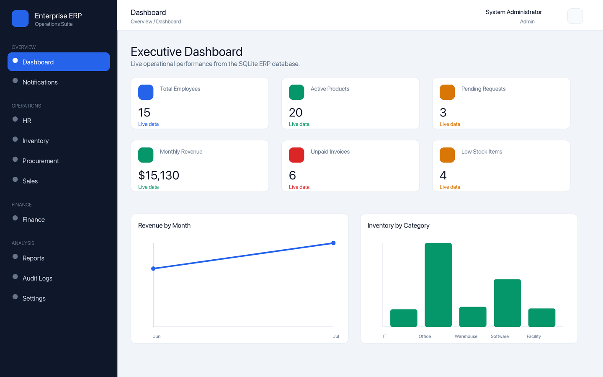
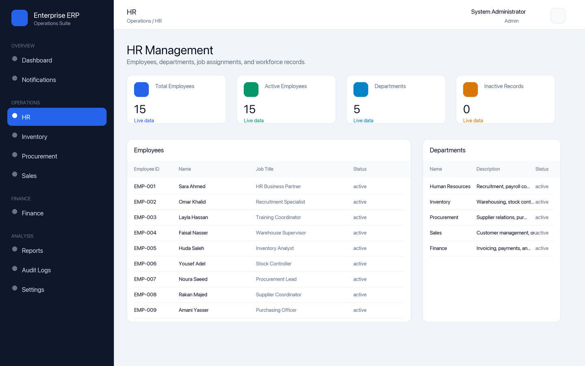
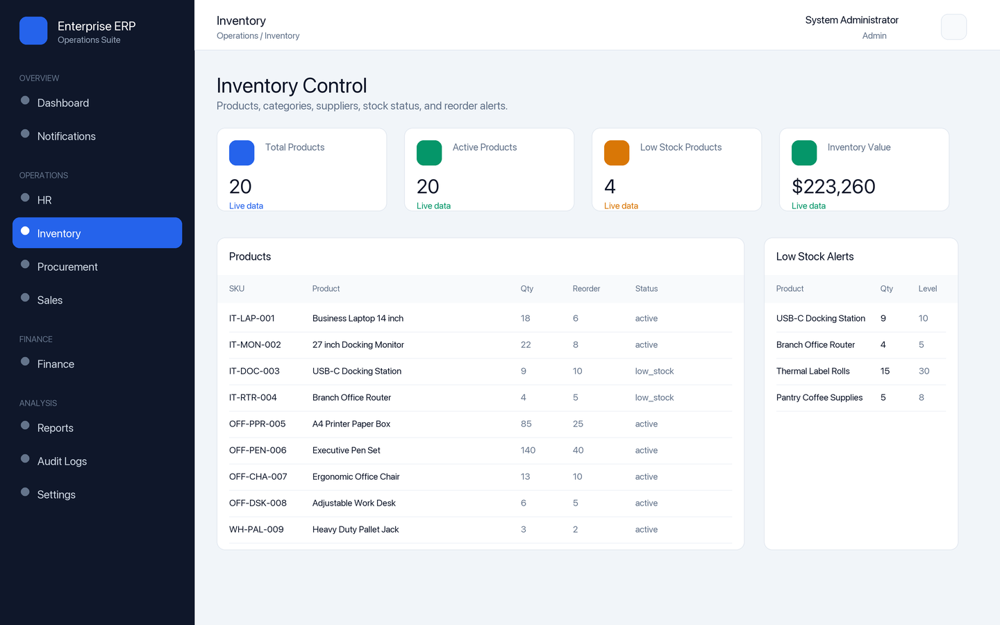
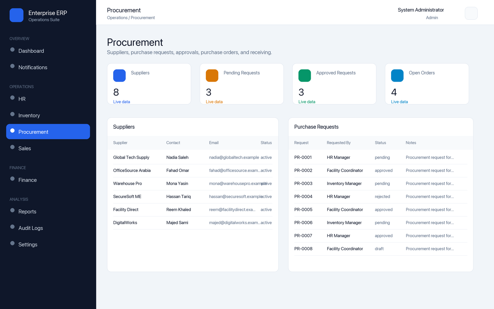
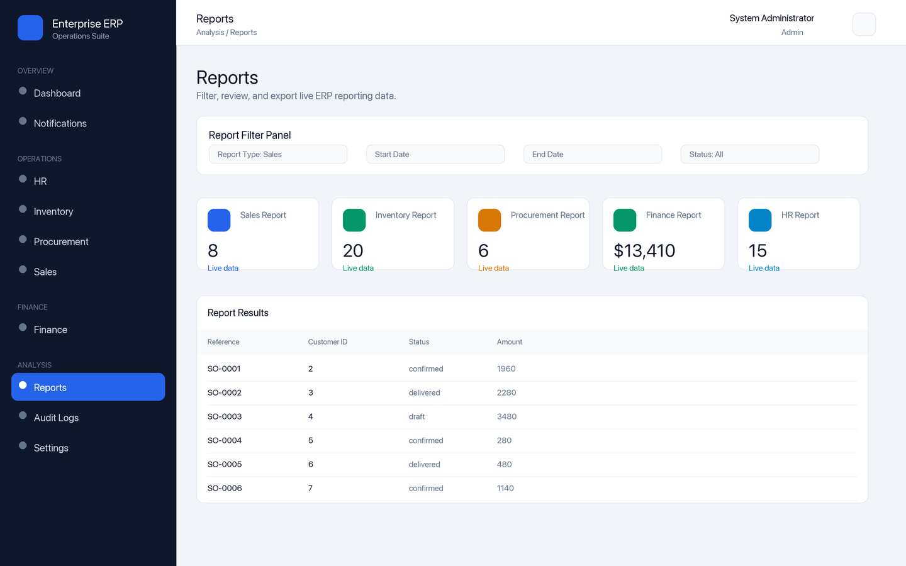
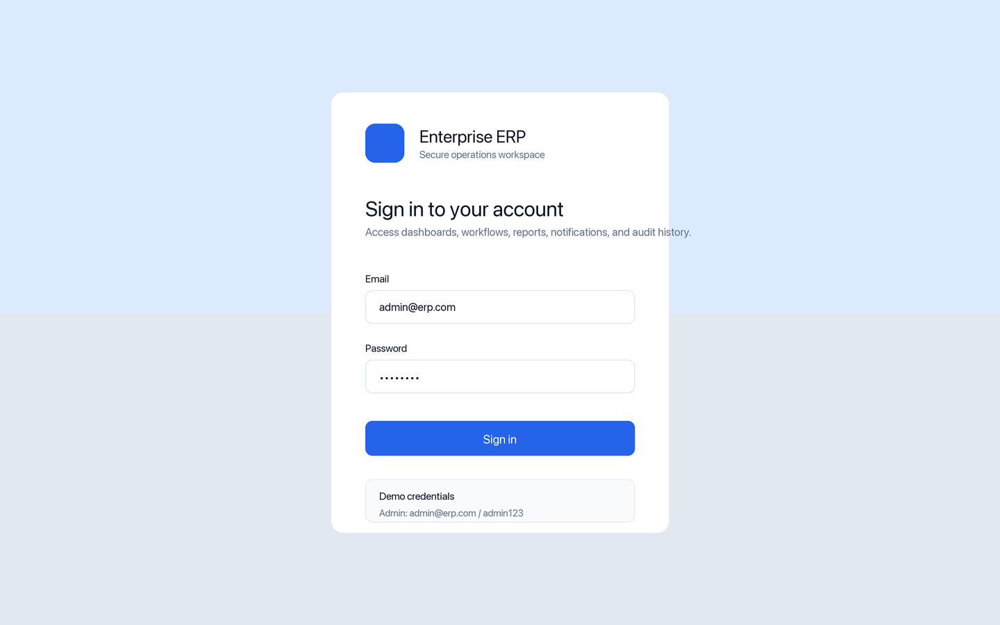

# Enterprise ERP System

## Project Overview

Enterprise ERP System is a professional Information Systems portfolio project that demonstrates enterprise resource planning, business process automation, database management, reporting, analytics dashboards, JWT authentication, role-based access, and full-stack application architecture.

The project uses a FastAPI backend, React TypeScript frontend, SQLite database for the local MVP, SQLAlchemy ORM, Tailwind CSS, Recharts, and Docker Compose.

## Business Problem

Growing organizations often manage HR, inventory, procurement, sales, finance, and reporting through spreadsheets or disconnected tools. This creates duplicated data, weak visibility, inconsistent approvals, manual reporting, and limited accountability.

This ERP system centralizes operational workflows into one structured platform with dashboards, module pages, audit logs, notifications, and secure role-based access.

## System Objectives

- Centralize enterprise records across departments.
- Automate common business workflows.
- Provide role-based access for different business users.
- Support management reporting and operational dashboards.
- Preserve traceability through audit logs.
- Demonstrate production-style repository structure, documentation, Docker setup, and full-stack engineering practices.

## Features

- JWT authentication and protected frontend routes
- Demo users for Admin, HR, Inventory, Procurement, Sales, Finance, and Viewer roles
- Dashboard KPI cards and Recharts analytics
- HR module for departments and employees
- Inventory module for product categories, products, and low-stock review
- Procurement module for suppliers, purchase requests, approvals, purchase orders, and receiving
- Sales module for customers, sales orders, confirmation, and delivery
- Finance module for invoices, payments, and finance summary
- Reports for sales, inventory, procurement, finance, and HR
- Notifications with mark-as-read workflow
- Audit logs for create, update, delete, approval, receiving, sales, payment, and notification actions
- Docker-ready backend and frontend services

## Dashboard

The dashboard displays:

- Total employees
- Total products
- Low-stock products
- Total suppliers
- Pending purchase requests
- Monthly sales revenue
- Unpaid invoices
- Recent activity
- Sales, inventory, procurement, and finance charts

Dashboard design notes are available in [docs/ui/dashboard_design.md](docs/ui/dashboard_design.md).

## Technologies

- Frontend: React, TypeScript, Vite, Tailwind CSS, React Router, Axios, Recharts, Lucide React
- Backend: FastAPI, SQLAlchemy, Pydantic, JWT, Passlib bcrypt
- Database: SQLite local demo database at `backend/erp.db`
- DevOps: Docker, Docker Compose
- Documentation: Markdown

## Architecture

```text
React Frontend
    ↓
FastAPI REST API
    ↓
Business Logic and Services
    ↓
SQLAlchemy ORM
    ↓
SQLite
```

Architecture details are documented in [docs/architecture/system_architecture.md](docs/architecture/system_architecture.md).

## Database Design

The database includes users, roles, departments, employees, suppliers, customers, product categories, products, purchase requests, purchase orders, sales orders, invoices, payments, notifications, and audit logs.

See [docs/database/erd.md](docs/database/erd.md), [database/schema.sql](database/schema.sql), and [database/sample_data.sql](database/sample_data.sql).

## API Documentation

When the backend is running, FastAPI OpenAPI documentation is available at:

```text
http://127.0.0.1:8000/docs
```

Endpoint groups are documented in [docs/api/api_documentation.md](docs/api/api_documentation.md).

## Screenshots

| Dashboard | HR Module |
|---|---|
|  |  |

| Inventory Module | Procurement Module |
|---|---|
|  |  |

| Reports | Login |
|---|---|
|  |  |

## How to Run Locally

Backend:

```bash
cd backend
python3 -m venv .venv
source .venv/bin/activate
pip install -r requirements.txt
cp .env.example .env
python seed.py
uvicorn app.main:app --reload
```

Frontend:

```bash
cd frontend
npm install
cp .env.example .env
npm run dev
```

## How to Run with Docker

```bash
cp backend/.env.example backend/.env
cp frontend/.env.example frontend/.env
docker compose up --build
```

Services:

- Frontend: `http://127.0.0.1:5173`
- Backend API: `http://127.0.0.1:8000`
- API Docs: `http://127.0.0.1:8000/docs`
The backend container runs the seed script during startup so the SQLite demo database is ready immediately.

## Demo Login Accounts

| Role | Email | Password |
| --- | --- | --- |
| Admin | admin@erp.com | admin123 |
| HR Manager | hr@erp.com | password123 |
| Inventory Manager | inventory@erp.com | password123 |
| Procurement Officer | procurement@erp.com | password123 |
| Sales Officer | sales@erp.com | password123 |
| Finance Officer | finance@erp.com | password123 |
| Viewer | viewer@erp.com | password123 |

## Project Structure

```text
Enterprise ERP System/
├── backend/
│   ├── app/
│   │   ├── models/
│   │   ├── routers/
│   │   ├── schemas/
│   │   ├── services/
│   │   └── utils/
│   ├── Dockerfile
│   ├── README.md
│   ├── requirements.txt
│   └── seed.py
├── database/
│   ├── sample_data.sql
│   └── schema.sql
├── docs/
│   ├── api/
│   ├── architecture/
│   ├── database/
│   ├── ui/
│   ├── requirements.md
│   ├── system_design.md
│   └── use_cases.md
├── frontend/
│   ├── src/
│   ├── Dockerfile
│   ├── README.md
│   └── package.json
├── screenshots/
├── docker-compose.yml
└── README.md
```

## Future Improvements

- Add Alembic migrations
- Add PostgreSQL as an optional production database profile
- Add automated backend and frontend test suites
- Add richer form validation and relational dropdown selectors
- Add exportable PDF/CSV reports
- Add deployment workflow and hosted demo
- Add real screenshots from a deployed environment
- Add CI checks for linting, tests, and Docker builds

## Author

Abdullah Alwadani
